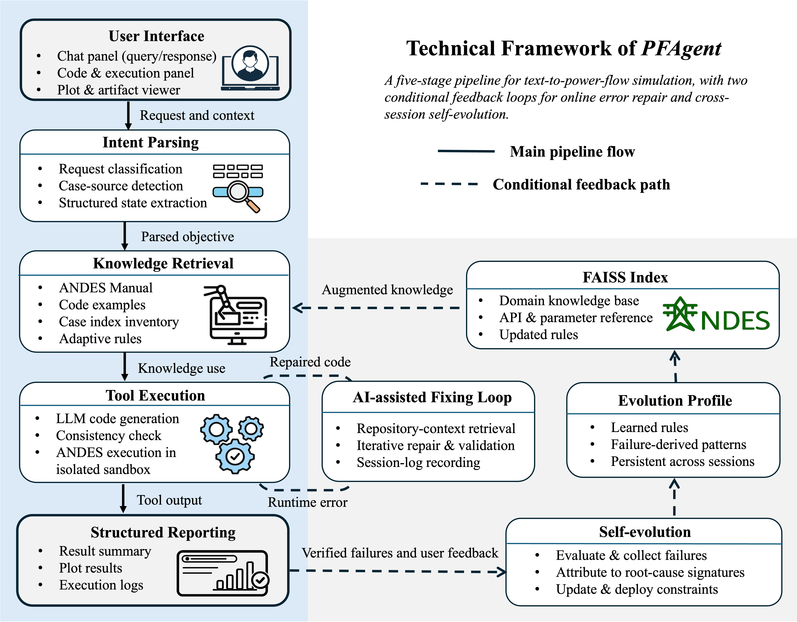

# PowerFlow-Agent (PFAGENT)

A Tractable and Self-Evolving Power-Flow Agent for Interactive Grid Analysis.

## Overview

PFAGENT is a research-and-product repository for building an agent that turns natural-language requests into executable ANDES power-flow studies.

The repository currently has three major responsibilities:

- `text-to-sim/`: the user-facing Streamlit application and agent runtime
- `knowledge/`: original sources, fine-tuning data, and the
  RAG assets the runtime loads (ANDES manual + few-shot code examples)
- `verification/`: the benchmark and report used to validate model and agent behavior

Technical framework:



## Repository Layout

```text
.
├── knowledge/              # Knowledge layer (merged from ANDES_Data + PowerFlow_Specific)
│   ├── raw/                #   original unprocessed sources (manual extraction, GitHub issues, notebooks)
│   ├── finetuning/         #   dev-stage fine-tuning data + generators + audits
│   │   ├── data/           #     training .jsonl / .json datasets
│   │   ├── scripts/        #     generators, audit, smoke test, trainer
│   │   └── generated/      #     intermediate experiment outputs
│   └── rag/                #   deployment-stage runtime-loaded assets
│       ├── andes_manual.pdf
│       └── code_examples/
├── docs/                   # Architecture, release, and governance documents
├── scripts/                # Convenience scripts for local execution
├── text-to-sim/            # Streamlit app, chatbots, runtime utilities, and tests
├── verification/           # Holdout benchmark suite, reports, and benchmark-facing docs
├── CONTRIBUTING.md         # Contributor workflow
└── environment.pfagent.yml # Recommended conda environment
```

See [docs/ARCHITECTURE.md](docs/ARCHITECTURE.md) for a system-level view.

## Quickstart

### 1. Create the environment

```bash
conda env create -f environment.pfagent.yml
conda activate pfagent
```

### 2. Launch the app

```bash
./scripts/run_text_to_sim_pfagent.sh
```

Or manually:

```bash
conda activate pfagent
cd text-to-sim
streamlit run main.py
```

### 3. Bring your own OpenAI key and model

When the introduction screen opens you must provide three pieces of
information:

| Field                              | Required for                                               | Notes                                                                                                                                    |
| ---------------------------------- | ---------------------------------------------------------- | ---------------------------------------------------------------------------------------------------------------------------------------- |
| **OpenAI API key**           | every mode                                                 | `sk-...`. Used only for the active session and never persisted.                                                                        |
| **Base chat model id**       | every mode                                                 | Any chat-completion model your key can call. Defaults to `gpt-4o-mini`. Other good choices: `gpt-4o`, `gpt-4.1`, `gpt-4.1-mini`. |
| **Fine-tuned chat model id** | only for the `Fine-tuned` and `Fine-tuned + RAG` modes | Your own OpenAI fine-tune identifier (starts with `ft:`).                                                                              |

> **Why isn't there a default fine-tune?** OpenAI fine-tune
> models are private to the API key that owns the fine-tune job. Even
> if PFAgent shipped a model id, no one else's key could call it. To
> use the `Fine-tuned` or `Fine-tuned + RAG` mode you must train your
> own fine-tune (or have one shared with your key) and paste its id
> at startup. The `Base OpenAI` and `RAG` modes work out of the box
> with any standard OpenAI key.

Power users can pre-set the same values as environment variables
before launching:

```bash
export OPENAI_BASE_CHAT_MODEL=gpt-4o-mini
export OPENAI_FINETUNED_MODEL=ft:gpt-4o-mini-2024-07-18:my-org:my-suffix:abc123
```

### 4. Recommended configurations

- pick `RAG` if you only have a base OpenAI key, or `Fine-tuned + RAG`
  if you also pasted your own fine-tune id
- initialize the agent
- confirm the official ANDES manual is preloaded
- use explicit prompts that clearly name the case source and desired outputs

The end-user prompt guide is in [verification/pfagent_user_manual_20260328.md](verification/pfagent_user_manual_20260328.md).

## Core Workstreams

### Application Runtime

The main application lives in [text-to-sim/](text-to-sim/).

It includes:

- Streamlit UI
- `Base OpenAI`, `Fine-tuned`, `GraphRAG`, and `Fine-tuned + RAG` modes
- ANDES-manual bootstrapping
- code execution and retry loops
- uploaded-file handling
- plot capture and rendering

App-specific setup notes live in [text-to-sim/README.md](text-to-sim/README.md).

### Knowledge Layer

Everything the agent learns from or loads at runtime lives in
[knowledge/](knowledge/). Three sub-layers:

- [knowledge/raw/](knowledge/raw/) — unprocessed original sources
  (manual extraction CSVs, GitHub issue crawls, sample notebooks)
- [knowledge/finetuning/](knowledge/finetuning/) — dev-stage
  fine-tuning data + the generators, audits, and smoke tests that
  produce it
- [knowledge/rag/](knowledge/rag/) — deployment-stage assets the
  runtime loads (`andes_manual.pdf` indexed into FAISS,
  `code_examples/` used as few-shot / repo-aware fixer context)

See [knowledge/README.md](knowledge/README.md) and
[knowledge/finetuning/README.md](knowledge/finetuning/README.md).

### Verification and Benchmarking

The holdout benchmark lives in [verification/](verification/).

It is designed to test:

- multi-turn continuity
- grounded case loading
- execution success
- semantic correctness against an ANDES API
- plot generation

See [verification/README.md](verification/README.md).

## Development Workflow

### Run unit tests

```bash
conda activate pfagent
python -m unittest discover -s text-to-sim/tests -p "test_*.py"
python -m unittest discover -s verification/tests -p "test_*.py"
```

### Run the verification benchmark

```bash
conda activate pfagent
python verification/runner.py --scenario-count 100
```

### Regenerate fine-tuning data

```bash
conda activate pfagent
python knowledge/finetuning/scripts/run_processes.py
```

Additional shortcuts are available in the root [Makefile](Makefile).
