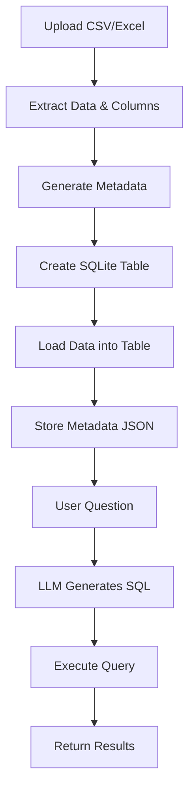

# Text-to-Sim

A large language model (LLM) agent that automates power system simulations, result summarization, and visualization. 

---

## Features

- **Document Processing**: Upload and query text, PDF, CSV, Excel, and code files with automatic content understanding
- **GraphRAG Integration**: Advanced retrieval using knowledge graphs (Neo4j) combined with vector similarity search for context understanding
- **Code Execution**: Run Python code with automatic syntax validation, error detection, and AI-powered error fixing
- **Natural Language Data Queries**: Query CSV/Excel files using plain English, with no SQL knowledge required
- **Session Management**: Choose between persistent and temporary document storage with automatic cleanup
- **Customizable Behavior**: Add custom instructions to improve LLM responses
- **Interactive && Transparent Development**: Edit and debug code directly in the interface with syntax highlighting and real-time validation
- **Learns from History**: Saves complete conversation histories including code edits, outputs, and data analysis results, which can be used to fine tune and improve LLM output
- **Multi-Format Support**: Handle diverse file types including documents, spreadsheets, and source code in 20+ programming languages

---

## Project Structure

```
text-to-sim/
├── main.py                  # Streamlit app entry point
├── graphrag_chatbot.py      # GraphRAG chatbot logic
├── main_fastapi.py          # (Optional) FastAPI backend
├── style.css                # Custom CSS for UI
├── requirements.txt         # Python dependencies
├── pyproject.toml           # Project metadata
├── data_files/              # Uploaded CSV/Excel files & metadata
│   ├── metadata.json        # Metadata for tabular files
│   ├── persistent/          # Persistent files
│   └── sessions/            # Session-specific files
├── code_executions/         # Per-session code execution sandboxes
├── documents/               # Uploaded documents
├── neo4j/                   # Neo4j database files
├── README.md                # Project documentation
└── ...
```

---

## Setup Instructions

### 1. Clone the Repository

```bash
git clone git@tanuki-data.pnnl.gov:buxin.she/ai4power.git
cd text-to-sim
```

### 2. Install Dependencies

- **Python 3.11+** is required.
- Install with pip:

```bash
pip install -r requirements.txt
```

### 3. Configure Environment Variables

Set the following environment variables (in `.env` or your shell):

- `NEO4J_URI` – Neo4j connection URI (e.g., `bolt://localhost:7687`)
- `NEO4J_USER` – Neo4j username
- `NEO4J_PASSWORD` – Neo4j password
- `CONDA_ENV_PATH` – Path to the `conda` executable

**Note**: You'll enter your OpenAI API key directly in the application interface for security.

### 4. Run the App

```bash
streamlit run main.py
```

---

---

## Notes

Uploaded CSV and Excel files are handled differently from text and code files. During testing, adding a CSV file directly to the LLM’s context reduced performance. Instead, CSV and Excel files are accessed through queries made by the LLM.



---

## Future Work

### Add Visualization
- Display graphs and charts (e.g. histograms) directly on the interface. 

### Automate Fine Tuning
- Currently requires manually running ```run_processes.py``` in ```./PowerFlow_Specific``` directory to generate and upload files to OpenAI for fine tuning. 
- Need to automate this process once it automatically detects enough datapoints. 

### Perform Demonstration and Validation
- Manually compare code with agent generated code, use metrics to quantify performance
- For each answer, we can develop some metrics, like compare real bus voltage to the one from agent, check voltage for each bus, etc.