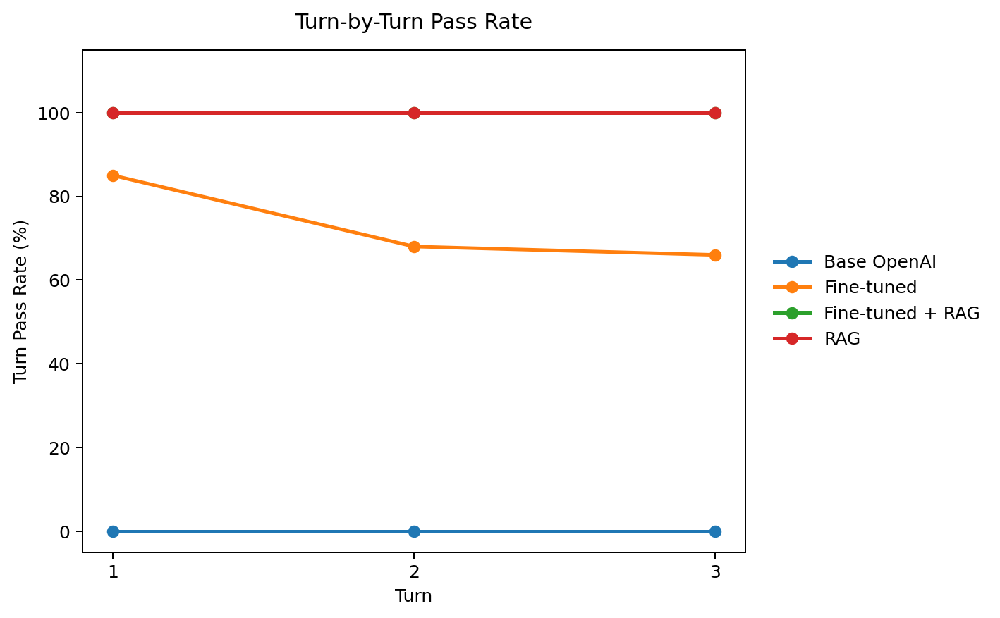
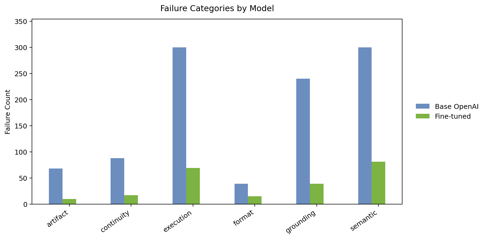

# PFAGENT Final Verification Report

Date: 2026-04-03

## 1. Scope

This document summarizes the current retained verification package for the latest PFAGENT agent revision.

The final benchmark run in this branch evaluates four product paths:

- `Base OpenAI`
- `RAG`
- `Fine-tuned`
- `Fine-tuned + RAG`

Benchmark coverage:

- `100` deterministic scenarios
- `3` turns per scenario
- `300` total turns per model path
- built-in ANDES cases and uploaded-case workflows
- add PQ load before setup
- slack/PV target changes
- follow-up case modifications
- voltage ranking and threshold filtering
- line-angle ranking and threshold filtering
- voltage plot generation

The current default fine-tuned model used in the app is:

- `ft:gpt-4.1-mini-2025-04-14:personal:pfagent:DOXJbJmU`

Canonical retained run root:

- [verification/final](/home/bshe/Documents/git-research/pfagent/verification/final)

## 2. Executive Summary

The current production story is clear.

- `RAG` achieved `100/100` scenario pass rate.
- `Fine-tuned + RAG` achieved `100/100` scenario pass rate.
- `RAG` achieved `300/300` turn pass rate.
- `Fine-tuned + RAG` achieved `300/300` turn pass rate.
- Pure `Fine-tuned` improved over earlier versions, but still finished at `58/100` scenario pass rate.
- `Base OpenAI` remained at `0/100` scenario pass rate.

The main conclusion is that retrieval-backed PFAGENT paths are now the reliable product surface for the covered power-flow task families. In this final holdout run, `RAG` and `Fine-tuned + RAG` tied at the top.

## 3. What Does `Conversation Score = 100.0` Mean?

In this benchmark, `100.0` means every turn passed all checks:

- `Format`: exactly one runnable Python code block
- `Grounding`: correct ANDES case loading and prompt-specific literal usage
- `Continuity`: required follow-up state is preserved across turns
- `Execution`: generated code runs successfully
- `Semantic`: `RESULT_JSON` matches the ANDES oracle
- `Artifact`: required plots are generated with the expected filename

So for `RAG` and `Fine-tuned + RAG`, `conversation score = 100.0` means the generated code ran successfully and produced the correct results for all three turns in every scenario.

## 4. Final Benchmark Snapshot

Final retained summary:

- run root: [verification/final](/home/bshe/Documents/git-research/pfagent/verification/final)
- summary: [verification_summary.md](/home/bshe/Documents/git-research/pfagent/verification/final/reports/verification_summary.md)

### Headline metrics

| Mode | Scenario pass rate | Avg conversation score | Turn pass rate | Execution pass rate | Semantic pass rate | Format pass rate |
| --- | --- | --- | --- | --- | --- | --- |
| `Base OpenAI` | `0.0%` | `46.35` | `0.0%` | `0.0%` | `0.0%` | `87.0%` |
| `Fine-tuned` | `58.0%` | `86.44` | `73.0%` | `77.0%` | `73.0%` | `95.0%` |
| `RAG` | `100.0%` | `100.0` | `100.0%` | `100.0%` | `100.0%` | `100.0%` |
| `Fine-tuned + RAG` | `100.0%` | `100.0` | `100.0%` | `100.0%` | `100.0%` | `100.0%` |

### Figure: overall score by mode

### Figure: turn-level comparison

### Figure: scenario-level comparison

### Figure: failure category comparison

## 5. Key Findings

### 5.1 Retrieval-backed paths are the validated product surface

The retained final run shows:

- `RAG`: `100/100` scenarios passed and `300/300` turns passed
- `Fine-tuned + RAG`: `100/100` scenarios passed and `300/300` turns passed

Across the retained benchmark families, this indicates that the current structured ANDES generation path is robust for the tested classes of user requests when the agent has ANDES-manual retrieval and the current agent-side guardrails.

### 5.2 Fine-tuning still helps the non-RAG path, but it is not sufficient by itself

Pure `Fine-tuned` mode is no longer collapsing immediately, but it still trails far behind the retrieval-backed paths:

- `58/100` scenarios passed
- `85% / 68% / 66%` turn pass rates across turns 1 to 3
- residual failures are still dominated by `semantic`, `execution`, and `grounding`

This supports the design choice to treat retrieval-backed operation as the primary product path.

### 5.3 Base model prompting alone is still not enough for this domain benchmark

The `Base OpenAI` path failed all `100` scenarios. The most common failure categories were:

- `execution`: `300`
- `semantic`: `300`
- `grounding`: `240`

This result reinforces that PFAGENT's performance comes from the agent system, not from a plain prompt-only wrapper around a general-purpose model.

### 5.4 On this holdout, `RAG` and `Fine-tuned + RAG` are tied

The current benchmark does not show a measurable gap between `RAG` and `Fine-tuned + RAG`. The most likely interpretation is that the current agent-side improvements now dominate this evaluated scope:

- manual-first retrieval
- structured ANDES code generation
- case-aware guardrails
- long-conversation compaction
- centralized prompt construction

That does not mean fine-tuning is useless; it means this specific holdout no longer separates the two retrieval-backed paths.

## 6. Representative Raw Evidence

For one concrete pure `Fine-tuned` example from the final retained run:

- response: [response.md](/home/bshe/Documents/git-research/pfagent/verification/final/raw/fine_tuned/scenario_001/turn_01/response.md)
- scored result: [turn_result.json](/home/bshe/Documents/git-research/pfagent/verification/final/raw/fine_tuned/scenario_001/turn_01/turn_result.json)

For one concrete `RAG` success example:

- response: [response.md](/home/bshe/Documents/git-research/pfagent/verification/final/raw/rag/scenario_001/turn_01/response.md)
- scored result: [turn_result.json](/home/bshe/Documents/git-research/pfagent/verification/final/raw/rag/scenario_001/turn_01/turn_result.json)

For one concrete `Fine-tuned + RAG` success example:

- response: [response.md](/home/bshe/Documents/git-research/pfagent/verification/final/raw/fine_tuned_rag/scenario_001/turn_01/response.md)
- scored result: [turn_result.json](/home/bshe/Documents/git-research/pfagent/verification/final/raw/fine_tuned_rag/scenario_001/turn_01/turn_result.json)

## 7. Overall Assessment

Current assessment of the agent:

- `RAG` and `Fine-tuned + RAG` are the validated primary product paths.
- For the benchmarked power-flow task families, the current agent can reliably follow user instructions, modify cases across follow-up turns, run ANDES code, and return correct outputs.
- Pure `Fine-tuned` mode is improved but still secondary.
- `Base OpenAI` is useful only as a comparison baseline, not as a production path.

## 8. Reference Files

- Final benchmark summary: [verification_summary.md](/home/bshe/Documents/git-research/pfagent/verification/final/reports/verification_summary.md)
- Model summary CSV: [model_summary.csv](/home/bshe/Documents/git-research/pfagent/verification/final/reports/tables/model_summary.csv)
- Turn summary CSV: [turn_summary.csv](/home/bshe/Documents/git-research/pfagent/verification/final/reports/tables/turn_summary.csv)
- Failure summary CSV: [failure_summary.csv](/home/bshe/Documents/git-research/pfagent/verification/final/reports/tables/failure_summary.csv)
- Full raw logs root: [raw](/home/bshe/Documents/git-research/pfagent/verification/final/raw)
- Final package overview: [README.md](/home/bshe/Documents/git-research/pfagent/verification/final/README.md)
