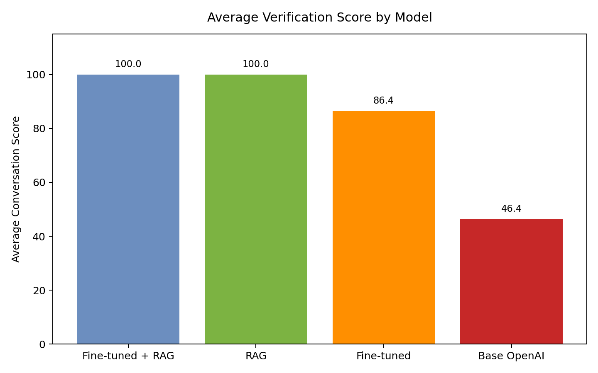
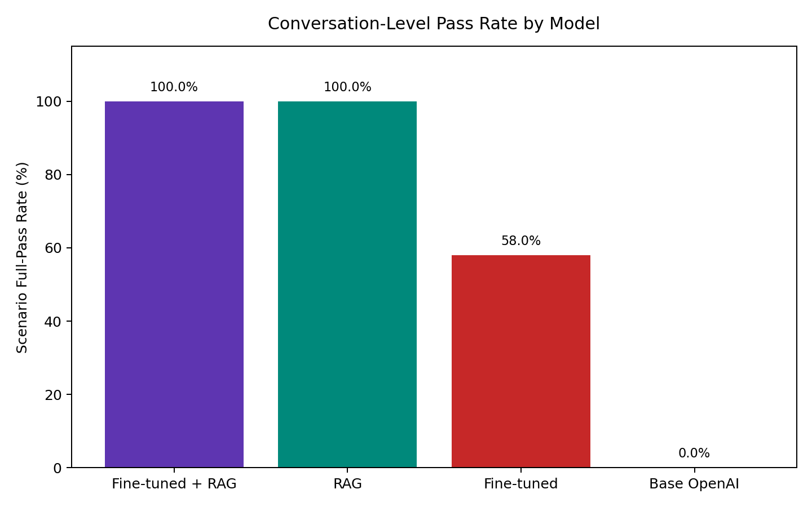

# PFAGENT User Manual

Date: 2026-04-03

## 1. Purpose

This manual explains how to write prompts that help PFAGENT produce more reliable ANDES power-flow code and results.

It is written for the current Streamlit application and reflects the current validated retrieval-backed product paths:

- strongly validated modes: `RAG` and `Fine-tuned + RAG`
- default knowledge source: the official ANDES manual is preloaded
- tested workflow: multi-turn power-flow studies with follow-up case modifications

This guide is especially useful if you want the agent to:

- load a built-in ANDES case
- use your own uploaded case file
- modify a case over multiple turns
- run power flow and report numeric results
- save and display plots in the UI

## 2. Which Mode to Use

For the best results, use a retrieval-backed mode.

The final retained benchmark shows:

- `RAG`: `100/100` scenario pass rate, `100.0` average conversation score
- `Fine-tuned + RAG`: `100/100` scenario pass rate, `100.0` average conversation score
- `Fine-tuned`: `58/100` scenario pass rate
- `Base OpenAI`: `0/100` scenario pass rate

If your UI exposes both retrieval-backed choices, either is validated on the current holdout. If you are following the app's main default path, `Fine-tuned + RAG` remains a safe choice.

The current final benchmark snapshot is shown below.



And the current scenario-level pass-rate figure is here.



The underlying benchmark report is available in [current_test_report_20260328.md](current_test_report_20260328.md).

## 3. Before You Start

Use this checklist before testing:

1. Select `RAG` or `Fine-tuned + RAG` in the UI.
2. Click `Initialize Agent`.
3. Confirm the app has preloaded the official ANDES manual.
4. If you are using your own case, upload the file first.
5. Use the exact uploaded filename in your prompt.

## 4. What Makes a Good Prompt

Reliable prompts usually do five things well:

### 4.1 State the case source clearly

Say whether the case is:

- a built-in ANDES case
- your uploaded file

Good:

```text
Use the built-in IEEE 14 full case.
```

```text
Use my uploaded file plant_study_39.xlsx.
```

Less helpful:

```text
Use IEEE 14.
```

```text
Use my case.
```

### 4.2 Ask for one concrete task sequence

The model does better when the order of operations is explicit.

Good:

```text
Use the built-in Kundur full case, add one PQ load at bus 9 before setup with p0=0.02 and q0=0.015, run power flow, and report buses outside [0.94, 1.06].
```

Less helpful:

```text
Use Kundur and make a change, then analyze it.
```

### 4.3 Specify the output format

If you want executable code, say so directly.

Recommended:

```text
Return exactly one runnable Python code block and no prose.
```

or

```text
Write one complete runnable Python script only, inside a single ```python block.
```

If you want explanation first, split it into two turns:

1. Ask for the plan or explanation.
2. Ask for the final runnable code only.

### 4.4 Be explicit in follow-up turns

In multi-turn studies, the model performs best when you clearly say what to keep from the prior turn.

Good:

```text
Keep the same case and keep the PQ load you added in the previous step. Now set the slack-bus voltage target to 1.03, rerun power flow, and save a voltage profile plot as ieee14_voltage_profile.png.
```

Less helpful:

```text
Now do the next step.
```

### 4.5 Give exact numbers, filenames, and thresholds

Good prompts include:

- exact bus number
- exact `p0` and `q0`
- exact voltage threshold
- exact plot filename
- exact uploaded filename

Example:

```text
Use my uploaded file west_area_case.xlsx, scale all PQ loads by 1.05, rerun power flow, and print the number of buses above 1.04 pu.
```

## 5. Prompt Templates That Usually Work Well

### 5.1 Built-in case template

```text
Return exactly one runnable Python code block and no prose.
Use the built-in IEEE 14 full case, run power flow, and print the slack-bus voltage together with the top-3 highest bus voltages.
```

### 5.2 Uploaded case template

```text
Return exactly one runnable Python code block and no prose.
Use my uploaded file plant_study_39.xlsx, run power flow, and print the maximum-voltage bus together with the minimum-voltage bus.
```

### 5.3 Follow-up template

```text
Follow-up request: keep the same case and keep all previous modifications.
Return exactly one runnable Python code block and no prose.
Also add one new PQ load at bus 9 before setup with p0=0.02 and q0=0.015, rerun power flow, and report all buses below 0.95 pu.
```

### 5.4 Plot template

```text
Return exactly one runnable Python code block and no prose.
Use my uploaded file plant_study_39.xlsx, run power flow, save a bus-voltage profile plot as plant_study_39_voltage_profile.png, and call plt.show().
```

## 6. Common Prompting Mistakes

These are the most common reasons results become weaker or less reliable:

| Mistake | Why it hurts | Better wording |
| --- | --- | --- |
| “Use IEEE 14” | The source and exact case variant are ambiguous | “Use the built-in IEEE 14 full case.” |
| “Use my case” | The filename is missing | “Use my uploaded file plant_study_39.xlsx.” |
| “Modify the system and analyze it” | The task order is unclear | “Add one PQ load at bus 9 before setup, run power flow, and print buses below 0.95 pu.” |
| “Continue from before” | Follow-up state may be underspecified | “Keep the same case and keep the previous PQ load addition.” |
| “Plot the result” | The expected artifact is vague | “Save a bus-voltage profile plot as voltage_profile.png and call plt.show().” |
| Asking for code and long prose together | It can reduce execution-ready output | Ask for code only, or split explanation and code into two turns |

## 7. Practical Rules of Thumb

If your goal is a correct runnable script, these habits help:

1. Ask for one script only.
2. Name the case source explicitly.
3. Tell the model exactly what to change.
4. Tell the model exactly what to print or save.
5. In follow-up turns, explicitly say what should be preserved from earlier turns.
6. Keep each turn focused on one primary study step.

## 8. Typical Multi-Turn Q&A Example A: Built-in ANDES Case

This example uses a built-in case and gradually modifies it across multiple turns.

### Turn 1

**User**

```text
Return exactly one runnable Python code block and no prose.
Use the built-in IEEE 14 full case, run power flow, and print the slack-bus voltage together with the top-3 highest bus voltages.
```

**What a strong answer usually looks like**

- it uses `andes.get_case(...)` for the built-in case
- it loads the case, runs power flow, and prints only the requested values
- it returns one complete runnable Python script

**Representative code pattern**

```python
import andes

case_path = andes.get_case("ieee14/ieee14_full.xlsx")
ssa = andes.load(case_path)
ssa.setup()
ssa.PFlow.run()
```

### Turn 2

**User**

```text
Follow-up request: keep the same case.
Return exactly one runnable Python code block and no prose.
Add one new PQ load at bus 9 before setup with p0=0.02 and q0=0.015, rerun power flow, and report all buses below 0.95 pu.
```

**What a strong answer usually looks like**

- it keeps using the same built-in case
- it adds the new PQ load before `setup()`
- it reruns power flow and prints the low-voltage buses

**Representative code pattern**

```python
import andes

case_path = andes.get_case("ieee14/ieee14_full.xlsx")
ssa = andes.load(case_path)
ssa.add("PQ", {"bus": 9, "p0": 0.02, "q0": 0.015})
ssa.setup()
ssa.PFlow.run()
```

### Turn 3

**User**

```text
Follow-up request: keep the same case and keep the PQ load you added in the previous step.
Return exactly one runnable Python code block and no prose.
Now set the slack-bus voltage target to 1.03, rerun power flow, print the maximum-voltage bus and minimum-voltage bus, and save a voltage profile plot as ieee14_voltage_profile.png.
```

**What a strong answer usually looks like**

- it keeps the built-in case
- it keeps the previously added PQ load
- it applies the slack change
- it reruns power flow
- it saves the requested plot file

**Representative code pattern**

```python
import andes
import matplotlib.pyplot as plt

case_path = andes.get_case("ieee14/ieee14_full.xlsx")
ssa = andes.load(case_path)
ssa.add("PQ", {"bus": 9, "p0": 0.02, "q0": 0.015})
ssa.setup()
ssa.Slack.set("v0", [1], 1.03)
ssa.PFlow.run()
plt.savefig("ieee14_voltage_profile.png")
plt.show()
```

### Why this example works well

- the case source is explicit in the first turn
- the follow-up turns clearly say what to keep
- every change is tied to a concrete value
- the output requirements are specific

## 9. Typical Multi-Turn Q&A Example B: Uploaded User Case

This example simulates a user who uploads a case file and then continues the study over multiple turns.

Assume the uploaded filename shown in the UI is:

```text
plant_study_39.xlsx
```

### Turn 1

**User**

```text
Return exactly one runnable Python code block and no prose.
Use my uploaded file plant_study_39.xlsx, run power flow, and print the maximum-voltage bus together with the minimum-voltage bus.
```

**What a strong answer usually looks like**

- it uses `andes.load("plant_study_39.xlsx")`
- it does not treat the uploaded file like a built-in case
- it runs power flow and prints the requested bus results

**Representative code pattern**

```python
import andes

ssa = andes.load("plant_study_39.xlsx")
ssa.setup()
ssa.PFlow.run()
```

### Turn 2

**User**

```text
Follow-up request: keep the same uploaded file.
Return exactly one runnable Python code block and no prose.
Scale all PQ loads by 1.05, rerun power flow, and print how many buses are above 1.04 pu.
```

**What a strong answer usually looks like**

- it keeps using the same uploaded file
- it applies the PQ scaling
- it reruns power flow
- it prints the requested threshold count

**Representative code pattern**

```python
import andes

ssa = andes.load("plant_study_39.xlsx")
ssa.setup()
ssa.PQ.set("p0", "v", ssa.PQ.p0.v * 1.05)
ssa.PQ.set("q0", "v", ssa.PQ.q0.v * 1.05)
ssa.PFlow.run()
```

### Turn 3

**User**

```text
Follow-up request: keep the same uploaded file and keep the PQ scaling from the previous step.
Return exactly one runnable Python code block and no prose.
Save a bus-voltage profile plot as plant_study_39_voltage_profile.png, call plt.show(), and print the top-5 highest bus voltages.
```

**What a strong answer usually looks like**

- it keeps the uploaded case
- it keeps the previous PQ scaling
- it saves the requested figure
- it calls `plt.show()` so the UI can display the plot

**Representative code pattern**

```python
import andes
import matplotlib.pyplot as plt

ssa = andes.load("plant_study_39.xlsx")
ssa.setup()
ssa.PQ.set("p0", "v", ssa.PQ.p0.v * 1.05)
ssa.PQ.set("q0", "v", ssa.PQ.q0.v * 1.05)
ssa.PFlow.run()
plt.savefig("plant_study_39_voltage_profile.png")
plt.show()
```

### Why this example works well

- the uploaded filename is exact
- the follow-up turns explicitly preserve prior study state
- the reporting and artifact requirements are concrete

## 10. Quick Prompt Reference

Use these short forms as a starting point.

| Goal | Recommended wording |
| --- | --- |
| Run a built-in case | “Use the built-in IEEE 14 full case, run power flow, and ...” |
| Run an uploaded case | “Use my uploaded file case_name.xlsx, run power flow, and ...” |
| Add a new PQ load | “Add one new PQ load at bus 9 before setup with p0=0.02 and q0=0.015 ...” |
| Scale all PQ loads | “Scale all PQ loads by 1.05 ...” |
| Change slack setpoint | “Set the slack-bus voltage target to 1.03 ...” |
| Filter buses by threshold | “Report all buses below 0.95 pu.” |
| Get ranked results | “Print the top-5 highest bus voltages.” |
| Save a plot | “Save a bus-voltage profile plot as voltage_profile.png and call plt.show().” |

## 11. What to Check in the Returned Code

When manually validating an answer in the UI, these are good signs:

- built-in case: the code uses `andes.get_case(...)`
- uploaded case: the code uses `andes.load("exact_filename")`
- new PQ additions happen before `setup()`
- the answer is one complete Python script
- the script prints the requested values
- plots are saved with the requested filename
- plots appear in the UI after execution

## 12. Final Recommendation

If you want the highest chance of getting correct ANDES power-flow code from the current PFAGENT app:

1. use `RAG` or `Fine-tuned + RAG`
2. be explicit about case source
3. ask for one runnable Python script only
4. give exact numeric values and filenames
5. make follow-up turns explicit about what should be preserved

That prompt style aligns best with the current agent design and with the cases that have already been validated in the benchmark suite.

## 13. Reference Files

- Benchmark summary: [verification_summary.md](final/reports/verification_summary.md)
- Current benchmark report: [current_test_report_20260328.md](current_test_report_20260328.md)
- Current benchmark PDF: [current_test_report_20260328.pdf](current_test_report_20260328.pdf)
